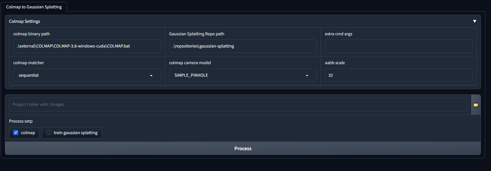

# gaussian_splatting_webui

for easy use gaussian_splatting

## colmap

This repo Contains only colmap webui,  
Follow these steps to install gaussian splatting in repositories folder

## gaussian splatting

* 設定 cmaker
```
  SET PATH=%PATH%; \your vc++ folder\VS2022\BuildTools\VC\Tools\MSVC\14.33.31629\bin\Hostx64\x64
```

```
git clone --recursive https://github.com/camenduru/gaussian-splatting

pip install -q plyfile

cd \gaussian-splatting\submodules\diff-gaussian-rasterization
python setup.py install

cd \gaussian-splatting\submodules\simple-knn
python setup.py install

wget https://huggingface.co/camenduru/gaussian-splatting/resolve/main/tandt_db.zip
unzip tandt_db.zip

python train.py -s /content/gaussian-splatting/tandt/train
```

## Note

如果有困難的話可以藉由查看 setup_ms.bat 的內容來得到一些安裝的靈感，
裡面是我安裝使用的步驟，直接執行可能無效，除非你的環境跟我一樣。

If you have difficulties, you can get some installation inspiration by viewing the contents of setup_ms.bat.
Inside are the steps I installed and used. Direct execution may not be effective unless your environment is the same as mine.

## screenshot 



## todo (有空才會做)

- [ ] 補完 colmap 參數
- [ ] 補完 gaussian splatting trainer 參數